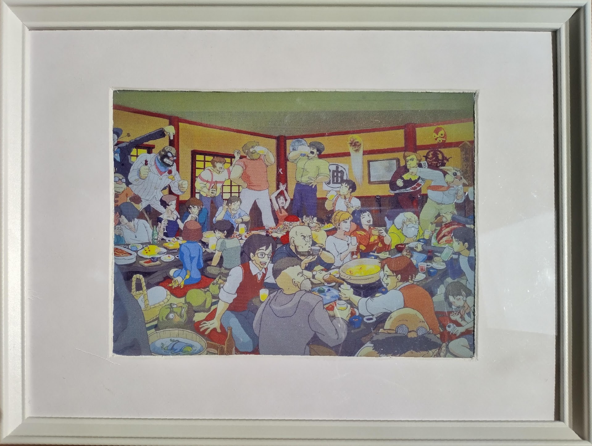
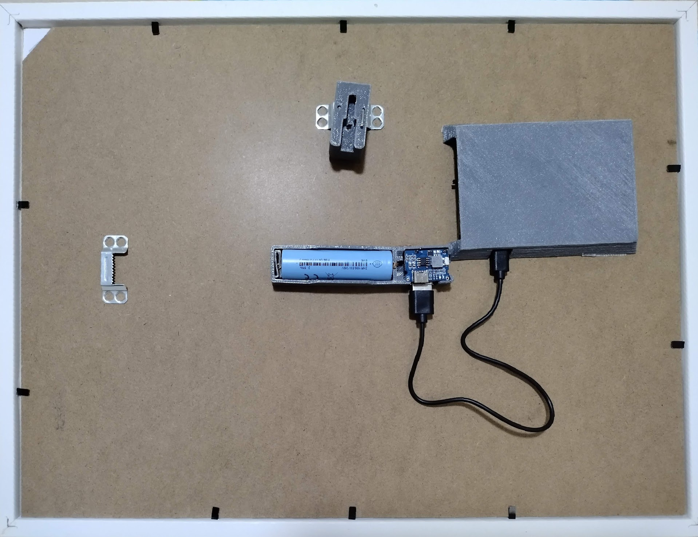
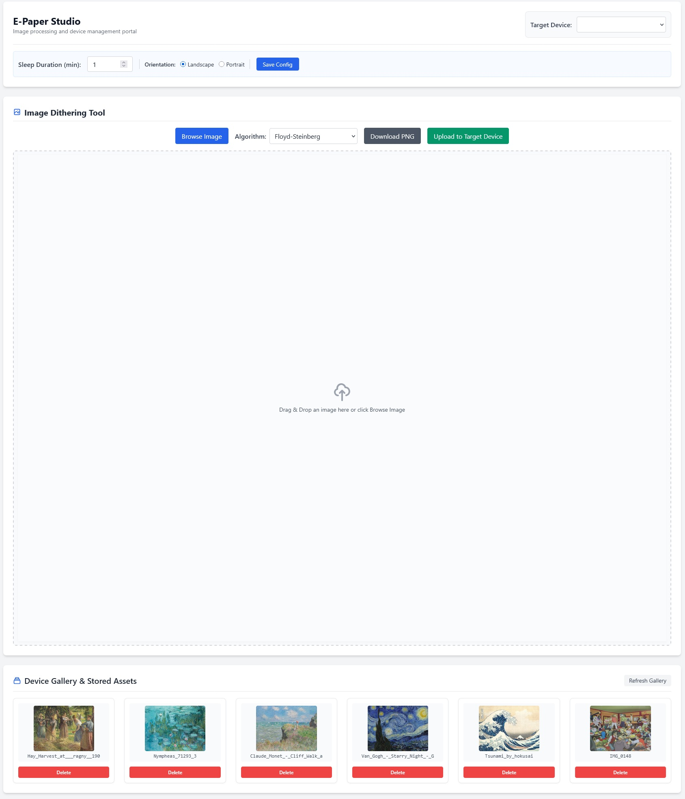

# 13.3" E-Paper Digital Photo Frame

An ultra-low-power, Wi-Fi-connected digital photo frame powered by
**ESP32-133C02** and a **13.3-inch Good Display E-Ink Spectra 6
(E6 / GDEP133C02)** color e-Paper display.

The ESP32 firmware provides:

- Wi-Fi DPP (Easy Connect) provisioning
- UDP multicast server discovery
- Scheduled HTTP synchronization
- LittleFS local image storage
- Hardware-button navigation
- Aggressive deep-sleep power management

The project also includes a dedicated **Node.js backend server** that
processes, crops, and dithers uploaded JPEG images into optimized
4-bit packed binary image buffers for the E-Paper display.

The ESP32 client periodically wakes from deep sleep, synchronizes
images over Wi-Fi, stores them in LittleFS, updates the display, and
returns to deep sleep.

---

<p align="center">
  
</p>
<p align="center">
  
</p>
<p align="center">
  
</p>

---

## Features & System Overview

### ESP32-133C02 Client Firmware
1. **Wi-Fi Easy Connect (DPP)**: Displays a provisioning QR code directly on the 13.3" E-Paper display for instant, passwordless setup via smartphone or router.
2. **Scheduled Sync**: Connects to the web server's REST API at set intervals (e.g., every 6 hours) to check for newly dithered images.
3. **Zero-Processing Display**: Downloads pre-dithered raw binary files directly into **LittleFS** storage without requiring CPU-intensive image processing on the ESP32.
4. **Deep Sleep Power Saving**: Disconnects Wi-Fi and enters deep sleep mode to maximize battery lifetime.
5. **Hardware Button Interrupt**: Supports manual wake-up via a physical push button on **GPIO 12** to trigger an immediate check-in and image refresh.

### Web Server & REST API
1. **Web Management Dashboard**: Upload original JPEGs and preview simulated E-Ink Spectra 6 RGB output using customizable dithering algorithms.
2. **Dual Storage Pipeline**: Saves both the high-resolution original image and the optimized 4-bit dithered binary file (`.bin`).
3. **Image Management API**: REST endpoints to query image lists, ordering, and metadata.
4. **Binary Download API**: Dedicated endpoint for the ESP32 client to pull raw dithered binary image streams.

---

## Hardware Requirements
| Feature | Specification |
| :--- | :--- |
| **Microcontroller** |  **ESP32-133C02** (ESP32-S3 with 16MB Flash) |
| **Display** | Good Display 13.3" Spectra 6 (`GDEP133C02`) |
| **Resolution** | 1200 × 1600 pixels (dual 600-pixel-wide driver sections) |
| **Storage** | On-chip Flash formatted with LittleFS (`storage` partition) |
| **Connectivity** | 2.4 GHz Wi-Fi (DPP / Easy Connect Enrollee support) |
| **Power Management** | Ext1 Deep Sleep Wakeup + Hardware Power Rail Switch (`LOAD_SW`) |
| **Power** | Li-ion Battery (18650) |
| **Frame** | Photo frame (Ikea KNOPPÄNG) |

---

## Hardware Pinout

### E-Paper Display (SPI)

| Signal Name | ESP32-S3 Pin | Description |
| :--- | :--- | :--- |
| **CLK (EPD_SCK)** | **GPIO 9** | SPI Clock Line |
| **MOSI (EPD_MOSI)** | **GPIO 41** | SPI Data Line (Master Out Slave In) |
| **MISO (EPD_MISO)** | **GPIO 40** | SPI Data Line (Master In Slave Out) |
| **DC (EPD_DC)** | **GPIO 2** | Data/Command Control Selection |
| **CS0 (EPD_CS_M)** | **GPIO 18** | Master Driver IC Chip Select |
| **CS1 (EPD_CS_S)** | **GPIO 17** | Slave Driver IC Chip Select |
| **EPD_RST** | **GPIO 6** | E-Paper Hardware Reset Signal |
| **EPD_BUSY** | **GPIO 7** | E-Paper Busy Status Indicator |
| **LOAD_SW** | **GPIO 45** | Power Switch MOSFET Control (High = Power On) |


### Navigation & Wakeup Buttons (Ext1 Interrupts)

| Button / Signal | GPIO Pin | Function |
| :--- | :--- | :--- |
| **SW2_WAKEUP** | **GPIO 12** | System Wakeup & Redraw current frame |
| **SW3_PREV_IMG** | **GPIO 13** | System Wakeup & Navigate to previous image |
| **SW4_NEXT_IMG** | **GPIO 14** | System Wakeup & Navigate to next image |

---

## Memory & Flash Partition Layout

The project uses a custom `partitions.csv` specifically optimized for 16MB Flash devices to maximize image storage:

| Partition | Size | Offset | Description |
| :--- | :--- | :--- | :--- |
| **`factory`** | `1200K` | `0x10000` | Application firmware (~238 KB free buffer) |
| **`storage`** | `15120K` | `0x13C000` | LittleFS partition holding up to 16 binary photos (~938 KB each) + `playlist.idx` |

---

## System Architecture & Lifecycle
```
      [ Wakeup: Timer / GPIO 12/13/14 ]
                       │
                       ▼
   [ Calculate Playlist Index & Read Buttons ]
                       │
                       ▼
       [ Check Wi-Fi Credentials in NVS ]
             │                   │
          ( Found )          ( Missing )
             │                   │
             │                   ▼
             │         [ Start Wi-Fi DPP Mode ]
             │                   │
             │                   ▼
             │           ( Render QR Code )
             │                   │
             │                   ▼
             │         [ Wait / 5m Timeout ]
             │                   │
             └─────────┬─────────┘
                       │
                       ▼
          [ Connect Wi-Fi & SNTP Sync ]
                       │
                       ▼
          [ Check Stored Server IP/Port ]
                 │                   │
              ( Found )          ( Missing )
                 │                   │
                 ▼                   │
        [ Try Direct Connect ]       │
              │           │          │
          (Success)    (Failed)      │
              │           └────┬─────┘
              │                │
              │                ▼
              │    [ UDP Multicast Discovery ]
              │                │
              └────────┬───────┘
                       │
                       ▼
                       │
                       ▼
          [ HTTP Sync (POST /api/sync) ]
                       │
                       ├─► ( Delete Old Files )
                       ├─► ( Download New .bin )
                       │
                       ▼
       [ Decode & Render Image in .bin ]
                       │
                       ▼
           [ Refresh E-Paper Display ]
                       │
                       ▼
 [ Cut Display Power Rail (LOAD_SW) & Enter Deep Sleep ]
```

---

## Network Protocol & API Specifications

### 1. UDP Multicast Server Discovery
- **Multicast Target**: Configured in `AppConfig::MULTICAST_IP` & `AppConfig::UDP_PORT`
- **Outbound Message**: `DISCOVER_ESP_SERVER`
- **Expected Response**: `SERVER_ACK:<HTTP_PORT>`

### 2. HTTP Synchronization (`POST /api/sync`)
The device identifies itself via HTTP Headers and sends its current image catalog.

#### Request Headers
```
http
POST /api/sync HTTP/1.1
Content-Type: application/json
x-device-mac: XX:XX:XX:XX:XX:XX
```

#### Request Payload
```
JSON

{
  "mac": "XX:XX:XX:XX:XX:XX",
  "images": [
    { "name": "photo01.bin" }
  ]
}
```

#### Response Payload
```
JSON

{
  "sleepDurationMin": 240,
  "delete": [
    "photo01.bin"
  ],
  "new": [
    {
      "name": "photo02.bin",
      "url": "/api/image/A1B2C3D4E5/photo02.bin"
    }
  ],
  "playlist": [
    "photo02.bin"
  ]
}
```

## Wi-Fi Provisioning (DPP / Easy Connect)
- **DPP Mode:** If NVS lacks valid Wi-Fi credentials, the system enters Device Provisioning Protocol (DPP) Enrollee mode and renders a QR Code directly onto the E-Paper display.
- **Timeout & Power Guard:** Provisioning and connection attempts are capped at a 5-minute total budget. If no connection is established within 5 minutes, the ESP32 automatically returns to Deep Sleep to preserve battery capacity.

---

## Storage & File System (LittleFS)
- **Partition Target:** Mounts under partition label `storage` formatted with LittleFS (configured in `partitions.csv`).

- **Limits:**
  - Maximum filename length strictly governed by `AppConfig::MAX_FILENAME_LEN` (supports `.bin` format images).
  - File count capped by `AppConfig::MAX_FILE_COUNT`.

- **Playlist State:** State tracking maintained via `playlist.idx`.

---


## Getting Started

### 1. ESP32 Client Setup
1. Clone the repository and navigate to the client folder:
   ```bash
   git clone https://github.com/cuckoo3/e-ink-photo-frame.git
   cd e-ink-photo-frame/photo-frame-client
   ```

2. Build and flash using ESP-IDF (Eclipse IDE or CLI):

   * **Eclipse IDE (ESP-IDF Plugin)**:
     1. Import the `photo-frame-client` directory as an ESP-IDF project (`File` -> `Import` -> `C/C++` -> `Existing Code as Makefile Project` or `ESP-IDF Project`).
     2. Set the target toolchain to **esp32s3**.
     3. Select your serial port in the launch configuration.
     4. Click the **Build** (hammer icon) button, followed by **Flash** (play icon) to upload the firmware.

   * **Command Line (Alternative)**:
     ```bash
     idf.py set-target esp32s3
     idf.py build
     idf.py -p <YOUR_PORT> flash monitor
     ```

### 2. Web Server Setup
1. Navigate to the server folder and install dependencies:
   ```bash
   cd e-ink-photo-frame/photo-frame-server
   npm install
   ```

2. Start the backend service:
   ```bash
   npm start
   ```

---
## AI-Assisted Development

This project was developed with substantial assistance from
Google Gemini and OpenAI ChatGPT for code generation, debugging,
troubleshooting, documentation, and development guidance.

The project author reviewed, modified, integrated, and tested
the generated code and is responsible for the final implementation.

---

## License

This project, including the original source code, firmware,
server software, documentation, and 3D models, is licensed under
the [PolyForm Noncommercial License 1.0.0](https://polyformproject.org/licenses/noncommercial/1.0.0).

Commercial use is not permitted without a separate license from
the copyright holder.

Third-party software and libraries included in or used by this
project remain subject to their respective licenses.

See [THIRD-PARTY-NOTICES.md](THIRD-PARTY-NOTICES.md) for details.

---

## ☕ Support

If you find this project helpful or use it for your own E-Paper display setup, consider buying me a coffee to support further development and hardware testing!

[](https://www.buymeacoffee.com/cuckoocuckoo)